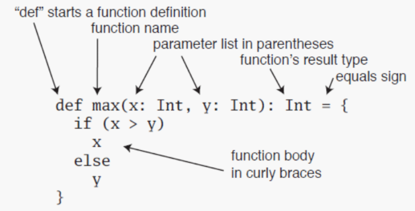

### 2.1 scala的方法与函数
#### 2.1.1 Scala方法的定义
- 有参方法的定义
- 无参方法


#### 2.1.2 递归方法
```scala
/**
     * 递归方法
     * 5的阶乘
     */
    def fun2(num :Int) :Int= {
      if(num ==1)
        num
      else
        num * fun2(num-1)
    }
    print(fun2(5))
```
#### 2.1.3 参数有默认值的方法
- 默认值的函数中，如果传入的参数个数与函数定义相同,则传入的数值会覆盖默认值。
- 如果不想覆盖默认值，传入的参数个数小于定义的函数的参数，则需要指定参数的名称。

#### 2.1.4 可变参数的方法
- 多个参数用逗号分开
```scala
/**
     * 可变参数个数的函数
     * 注意：多个参数逗号分开
     */
    def fun4(elements :Int*)={
      var sum = 0;
      for(elem <- elements){
        sum += elem
      }
      sum
    }
    println(fun4(1,2,3,4))
```

#### 2.1.5 匿名函数
1. 有参匿名函数
2. 无参匿名函数
3. 有返回值的匿名函数
- 可以将匿名函数返回给val定义的值
- 匿名函数不能显示声明函数的返回类型
```scala
 /**
     * 匿名函数
     * 1.有参数匿名函数
     * 2.无参数匿名函数
     * 3.有返回值的匿名函数
     * 注意：
     * 可以将匿名函数返回给定义的一个变量
     */
    //有参数匿名函数
    val value1 = (a : Int) => {
      println(a)
    }
    value1(1)
    //无参数匿名函数
    val value2 = ()=>{
      println("I love you")
    }
    value2()
    //有返回值的匿名函数
    val value3 = (a:Int,b:Int) =>{
      a+b
    }
    println(value3(4,4))
```
#### 2.1.6 嵌套方法
```scala
 /**
     * 嵌套方法
     * 例如：嵌套方法求5的阶乘
     */
    def fun5(num:Int)={
      def fun6(a:Int,b:Int):Int={
        if(a == 1){
          b
        }else{
          fun6(a-1,a*b)
        }
      }
      fun6(num,1)
    }
    println(fun5(5))
```
::: warning
浅试一试
:::
#### 2.1.7 偏应用函数
- 偏应用函数是一种表达式,不需要提供函数需要的所有参数，只需要提供部分,活不提供所需参数。
```scala
 /**
     * 偏应用函数
     */
    def log(date :Date, s :String)= {
      println("date is "+ date +",log is "+ s)
    }

    val date = new Date()
    log(date ,"log1")
    log(date ,"log2")
    log(date ,"log3")

    //想要调用log，以上变化的是第二个参数，可以用偏应用函数处理
    val logWithDate = log(date,_:String)
    logWithDate("log11")
    logWithDate("log22")
    logWithDate("log33")
```

#### 2.1.8 高阶函数
函数的参数是函数，或者函数的返回类型是函数，或者函数的参数和函数的返回类型是函数的函数。
- 函数的参数是函数
- 函数的返回是函数
- 函数的参数和函数的返回是函数
```scala
/**
     * 高阶函数
     * 函数的参数是函数		或者函数的返回是函数		或者函数的参数和返回都是函数
     */

    //函数的参数是函数
    def hightFun(f : (Int,Int) =>Int, a:Int ) : Int = {
      f(a,100)
    }
    def f(v1 :Int,v2: Int):Int  = {
      v1+v2
    }

    println(hightFun(f, 1))

    //函数的返回是函数
    //1，2,3,4相加
    def hightFun2(a : Int,b:Int) : (Int,Int)=>Int = {
      def f2 (v1: Int,v2:Int) :Int = {
        v1+v2+a+b
      }
      f2
    }
    println(hightFun2(1,2)(3,4))

    //函数的参数是函数，函数的返回是函数
    def hightFun3(f : (Int ,Int) => Int) : (Int,Int) => Int = {
      f
    }
    println(hightFun3(f)(100,200))
    println(hightFun3((a,b) =>{a+b})(200,200))
    //以上这句话还可以写成这样
    //如果函数的参数在方法体中只使用了一次 那么可以写成_表示
    println(hightFun3(_+_)(200,200))
```
#### 2.1.9 柯里化函数
- 高阶函数简化
```scala
 /**
     * 柯里化函数
     */
    def fun7(a :Int,b:Int)(c:Int,d:Int) = {
      a+b+c+d
    }
    println(fun7(1,2)(3,4))
```
::: warning
编程语言很多的思想都是相同的,掌握好一门理解其他的语言就会容易很多
:::