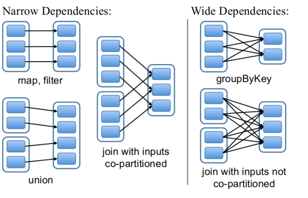

### 
1.1 RDD核心编程

#### 1.1.1 什么是RDD
   RDD是Spark的基石,是实现Spark数据处理的核心抽象。
   RDD是一个抽象类,它代表一个不可变,可分区,里面的元素可并行计算的集合。
##### RDD包含五个特征

1. 一个分区的列表
2. 一个计算函数compute,对每个分区进行计算
3. 对其他RDDs的依赖(宽依赖,窄依赖)列表
4. 对key-value RDDs来说,存在一个分区器(Partitioner)[可选的]
5. 对每个分区有一个优先位置的列表[可选的]

- 一组分片(Partition),即数据集的基本组成单位。对于RDD来说,每个分片都会被一个计算任务处理,并决定并行计算的粒度。用户可以在创建RDD时指定RDD的分片个数,如果没有指定,那么就会采用默认值；
- 一个对分区数据进行计算的函数。Spark中RDD的计算是以分片为单位的。每个RDD都会实现compute函数以达到该目的。compute函数会对迭代器进行组合,不需要保存每次计算的结果；
- RDD之间存在依赖关系。RDD的每次转换都会生成一个新的RDD,RDD之间形成类似于流水线一样的前后依赖关系(lineage)。在部分分区数据丢失时,Spark可以通过这个依赖关系重新计算丢失的分区数据,而不是对RDD的所有分区进行重新计算；
- 对于key-value的RDD而言,可能存在分区器(Partitioner)。Spark实现了两种类型的分片函数，一个是基于哈希的HashPartitioner，另一个是基于范围的RangePartitioner。只有 key-value 的RDD，才可能有Partitioner，非key-value的RDD的Parititioner的值是None。Partitioner函数决定了RDD本身的分
  片数量，也决定了parent RDD Shuffle输出时的分片数量;
- 一个列表,存储每个Partition的优先位置(preferred location)。对于一个HDFS文件来说,这个列表保存的就是每个Partition所在的块的位置。

#### 1.2 RDD的特点
1. 分区  RDD逻辑上是分区的,每个分区的数据是抽象存在的,计算的时候会通过一个compute函数得到每个分区的数据。如果RDD是通过已有的文件系统构建,则compute函数是读取指定文件系统中的数据,如果RDD是通过其他RDD转换而来,则compute函数是执行转换逻辑将其他RDD的数据转换。
2. 只读  RDD是只读的,要想改变RDD中的数据,只能在现有的RDD基础上创建新的RDD;一个RDD转换为另外一个RDD,通过丰富的操作算子(map,filter,union,join,reduceByKey......)实现,不再像MR那样只能写map和reduce了。

RDD的操作算子包括两类:
- transformation。用来对RDD进行转化,延迟执行(Lazy)。
- action。用来出发RDD的计算;得到相关计算结果或者将RDD保存的文件系统中;
3. 依赖  RDDs通过操作算子进行转换,转换得到的新RDD包含了从其他RDDs衍生所必须的信息,RDDs之间维护着这种血缘关系(lineage),也称之为依赖。依赖包含两种
  - 窄依赖。RDDS之间分区是一一对应的(1:1或n:1)
  - 宽依赖。子RDD每个分区与父RDD的每个分区都有关,是多对多的关系(即n:m)。有shuffle发生
  
4. 缓存 
   - 可以控制存储级别(内存,磁盘等)来进行缓存。
   - 如果在应用程序中多次使用同一个RDD，可以将该RDD缓存起来，该RDD只有在第一次计算的时候会根据血缘关系得到分区的数据，在后续其他地方用到该RDD的时候，会直接从缓存处取而不用再根据血缘关系计算，这样就加速后期的重用。
5. checkpoint  虽然RDD的血缘关系天然地可以实现容错，当RDD的某个分区数据失败或丢失，可以通过血缘关系重建。但是于长时间迭代型应用来说，随着迭代的进行，RDDs之间的血缘关系会越来越长，一旦在后续迭代过程中出错，则需要通过非常长的血缘关系去重建，势必影响性能。RDD支持checkpoint 将数据保存到持久化的存储中，这样就可以切断之前的血缘关系，因为checkpoint后的RDD不需要知道它的父RDDs了，它可以从 checkpoint处拿到数据。
  
### 
1.2RDD的创建
      