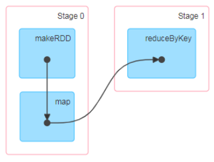

### 
1.1 spark的运行架构

Spark框架的核心是一个计算引擎,整体来说,它采用了标准的master-slave结构。
如图所示，它展示了有个Spark执行时的基本结构。图形中的Driver表示master,负责管理集群中的作业任务调度。图形中的Executor则是slave,负责实际执行任务。

### 1.2 spark的核心组件

#### 1.2.1 Driver
  Spark驱动器节点,用于执行Spark任务中的main方法,负责实际代码的执行工作。Driver在Spark作业执行时主要fuze
  - 将用户程序转换为作业(job)
  - 在Executor之间调度任务(task)
  - 跟踪Executor的执行情况
  - 通过UI展示查询运行情况

  实际上,我们无法准确地描述Driver的定义,因为在整个的编程过程中没有看到任何有关Driver的字眼。所以简单理解,所谓的Driver就是驱使整个应用运用起来的程序,也称为Druver类。
  
#### 1.2.2 Executor
  Spark Executor是集群中工作节点(Worker)中的一个JVM进程，负责在Spark中作业中运行具体任务(Task),任务批次之间相互独立。Spark应用启动时,Executor节点被同时启动,并且始终伴随着整个Spark用的生命周期而存在。如果有Executor节点发生了故障或崩溃,Spark应用也可以继续执行,会将出错节点调度到其他Executor节点上继续运行。

Executor有两个核心功能
- 负责运行组成Spark应用任务,并将结果返回给驱动器进程
- 它们通过自身的块管理器(Block Manager)为用户程序中要求缓存的RDD提供内存式存储。RDD是直接缓存在Executor进程内的,因此任务可以在运行时充分利用缓存数据加速运算。

#### 1.2.3 Master & Worker
  Spark集群的独立部署环境中,不需要依赖其他的资源调度框架,自身就实现了资源调度功能,所以环境中还有其他两个核心组件:Master和Worker,这里的Master是一个进程,主要负责资源的调度和分配,并进行集群的监控等职责,类似于Yarn环境中的RM,而Worker,也是进程,一个Worker运行在集群中的一台服务器上,由Master分配资源对数据进行并行的处理和计算,类似于Yarn中的NM。
  
#### 1.2.4 ApplicationMaster
  Hadoop用户向YARN集群提交应用程序时,提交程序中应该包含ApplicationMaster,用于向资源调度器申请执行任务的资源容器(Container),运行用户自己的程序job,监控整个任务的执行,跟踪整个任务的状态,处理任务失败等异常情况。
  
::: tip 提示
  也就是说ResourceManager(资源)和Driver(计算)之间的解耦合靠的就是ApplicationMaster。
:::

### 1.3 核心概念
#### 1.3.1 Executor与Core(核)
  Spark Executor就是集群中运行在工作(Worker)中的一个JVM进程。是整个集群中的专门用于计算的节点。在提交应用中,可以提供参数指定计算节点的个数,以及对应的资源。这里的资源一遍指的是工作节点Executor的内存大小和使用的虚拟CPU核(Core)数量。
  名称 |  
说明

  ----|-----:
  --num-executors|配置Executor的数量
  --executor-memory|配置每个Executor的内存大小
  --executor-cores|配置每个Executor的虚拟CPU core数量
  
#### 1.3.2 并行度(Parallelism)
  在分布式计算框架中一般都是多个任务同时执行,由于任务分布在不同的计算节点进行计算,所以能够真正地实现多任务并行执行。这里是并行,而不是并发。这里我们将占整个集群并行执行任务的数量称之为并行度。
  
#### 1.3.3 有向无环图(DAG)
  
  
DAG(Directed Acyclic Graph)有向无环图是由点和线组成的拓扑形,改图形具有方向,不会闭环。

### 1.4 提交流程图
  
  ::: tip 提示
  是基于Yarn模式
  :::
  
#### 1.4.1 Yarn Client模式
  Client模式将用于监控和调度的Driver模块在客户端执行,而不是在Yarn中,所以一般用于测试。
  - Driver在提交的本地机器上运行
  - Driver 启动后悔和ResourceManager通讯申请启动ApplicationMaster
  - ResourceManager分配container,在合适的NodeManager上启动ApplicationMaster,负责向ResourceManager申请Executor内存
  - ResourceManager接到ApplicationMaster的资源申请后会分配container,然后ApplicationMaster在资源分配指定的NodeManager上启动Executor进程
  - Executor进程启动后会反向Driver注册,Executor全部注册完成后Driver开始执行main。
  - 之后执行到Action算子时,粗发一个Job,并根据宽依赖开始划分stage,每个stage对应的TaskSet,之后将task分发各个Executor上执行。
